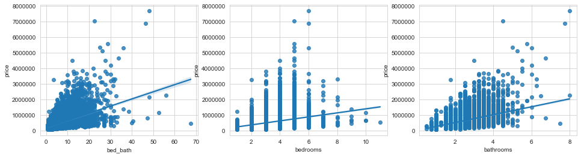

# King County Housing Price Predictions

### Using linear regression to predict housing prices in Seattle

**Author**: [Tim Hintz](mailto:tjhintz@gmail.com)

## Overview

The present research utilized the King County data set to build a predictive linear model of housing prices in that region. The present model generated 420 features via interactions and polynomial columns as well as some non-linear transformations of the square footage columns. 

I made a focus on geospatial analysis. Due to time constraints, I was unable to scrape location data for key features like good schools, water fronts and public transport. Instead I used Geohash2 to fit a z-space curve filling line to my region. I then dummied all of the columns and included them in my dataset. 

RFE and K best did not improve my models RMSE through feature selection. However Lasso regression brought my RMSE down by almost $10,000. My final model is therefore a sklearn lasso regressor object that has been pickled and stored as `model.pickle`

Due to this being a predictive problem, my results are not interpretable.

### Business Problem

We need to be able to accurately predict the price of a house based on it's features in order to compete in the market. If you undervalue the property you lose money on the investment and if you over price your house you run the risk of not selling the property at an opportune time. 

This model allows you to predict housing prices. with `still don't know the official RMSE`

### The Data

In the folder `raw` are movie datasets from:

* https://www.kingcounty.gov/services/gis/GISData.aspx
* Flatiron School
* Kaggle

In the folder `cleanedData` are the data frames that I use in my model construction.

### Methods

No data cleaning was used apart from the imputation of 12 observations that had been determined to have false records when I cross referenced them with Zillow listings and infered from google maps. 

The data was standardized using sklearn's standard scalar. The same scalar is pickled as scalar.pickle in the repo and was used to transform my test set.

I used independent T tests to decide which features were key in determining price. Then I created interaction columns and polynomial columns for all of my features. In handling geospatial data, I geohashed the houses based on their coordinates and createde dummy columns for the geohashes. The zipcodes were also dummied and added to the data set. Before lasso regression I had 420 features. 

When developing my model, after adding or modifying any feature I conducted a train test split on the data followed by an analysis of RMSE. If it went down, I continued, otherwise I would backtrack and try something else. Before I used Lasso my train test split gave me 129K with a 10 fold cross validation score of 0.84 with a std of 0.01.

For Lasso regression I used an alpha of 0.01, 0.02 and 0.03 but visually I did not see a change in the distribution. When I ran a Levene's test for difference in variation between them was not significant. 

### Results

#### The location of the house is important in determining it's price 

Houses located near water or clustered together with other houses have a much higher price than those inland and in isolation. 

When I ran a RFE to determine the most important features, I found that all of the top 10 were either geohashes or zipcodes indicating that they had the most significant correlation. However, as they were dummy columns and I had a lot of colinearity between features. For instance, geohash and zipcode is almost perfectly correlated. Therefore the interpretation becomes difficult. The zipcode for Bellevue (98093) was also significant, and when I decoded the top 5 geohashes they were all along the water front, near down town 

#### There was a signeficant effect of interactions between key variables 

I was interested in the interplay between features. I looked at the relationship between number of bedrooms, number of bathrooms and then I looked at the correlation between the interaction. I found that bathrooms times bedrooms correlated more heavily and significantly with price than either  bathrooms or bedrooms aloned. Each increase in bathroom increases the value of a home by $26,000 whereas if bed and bath increase together, the increase in value was $60,000. 

I decided that if there was a multiplicative relationship 

#### Lasso didn't not yield a significantly better predictions than regular Linear regression

I ran a Lasso Regression model in parallel to with my regression model and Levene failed to reject  indicating that the distribution of my predictions for the two models was similar. 

However, the RMSE for the my Lasso regression was upwards of 500k. This was inline with my findings from RFE and K best feature selection hurting my model.
#### Conclusions

I created a black box model. The conclusions are not easy to explain. In particular, the colinearity between the features and feature interactions means that the traditional interpretation of:
"How much does price change in response to a change in feature x when all other features don't change?" is impossible to answer when we are interacting variables.

However, our goal was to predict the house price, not build an inferential model. With 420 variables we had an RMSE of 129K. This gives an error of 0.24% (RMSE/mean). 

#### Further Research

- Scrape the web for zipcode census data to enrich the my spatial data
- Scrape the web for locations of schools and public transport to increase spatial data
- Look for the ratio between listings and sales throughout a year. Domain research indiates that is an important seasonal variable. 

#### Navigation
- `finalModel.ipynb`: Model development as statistical analysis
- `./eda`: file containing preliminary data analysis and visualisations
- `./raw`: File containing raw data files including shape files
- `./cleaned`: Original data obtained through the Flatiron School
- `./model`: Where my models are stored. Model one and model two
- `README.md`: Display document containing our key findings and this sentence.
- `src.py`: Collected functions utilized for both data cleaning and EDA

